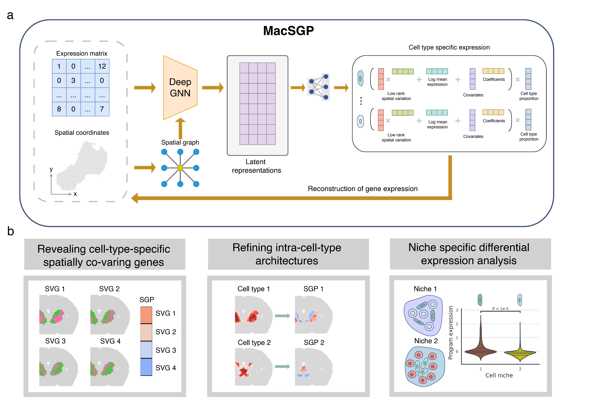

=====
Usage: 
=====

Required data
=============

* Spatial transcriptomic (ST) data: gene expression + spatial coordinates;

* Annotated single-cell RNA-sequencing (scRNA-seq) data: gene expression + cell type labels.

Preprocessing
=============
First, we need to prepare the ST data and reference data into two ``AnnData`` objects, which is the standard data class we use in ``MacSGP``. If you’re unfamiliar, you can refer to their `documentation <https://anndata.readthedocs.io/en/latest/index.html>`_ for details on creating ``AnnData`` objects from scratch and importing other formats (CSV, MTX, Loom, etc.) into ``AnnData``.

Here we use the 10x visium mouse brain data for example, the ``h5ad`` project of ST data and reference data can be downloaded from here. 

* link1

* link2

.. code-block:: python

   import scanpy as sc
   imort os

   adata_st = sc.read_h5ad(os.path.join('./', "adata_st.h5ad")) # ST data
   adata_ref = sc.read_h5ad(os.path.join('./', "adata_ref.h5ad")) # reference data

By default, we suppose ``adata.X`` stores the raw UMI counts of ST and scRNA-seq gene expression matrix, ``adata_st.obsm['spatial']`` stores the spatail coordinates, and ``adata_ref.obs['celltype']`` stores the cell type labels. 

We first build spatial neighbor graph based on spatial coordinates for ST data.

.. code-block:: python

   from MacSGP.utils import Cal_Spatial_Net
   
   Cal_Spatial_Net(adata_st, mode='KNN', k_cutoff=6)

Then, we normalize the data and select highly variable genes, ``adata_ref`` is summarized to ``adata_basis`` which contains the average expression profiles for each cell type.

.. code-block:: python

   from MacSGP.utils import preprocess
   
   adata_st, adata_basis = preprocess(adata_st,adata_ref,
                                    celltype_ref_col = "celltype",
                                    n_hvg_group = 500)

Overview of MacSGP
==================

Cell type deconvolution
=======================

To distinguish cell-type-specific SGPs from cell type markers, we first need to estimate the cell type proportions to account for cell type mixtures through deconvolution methods. Here we provide our own implementation for cell type deconvolution that leverages deep graph neural networks and keeps consistency between the deconvolution results and the MacSGP model in terms of the definition of cell type proportion and correction of platform effects between ST and scRNA-seq technologies.

.. code-block:: python

   from MacSGP.model import Model_deconv

   # deconvolution mode
   model = Model_deconv(adata_st, adata_basis, n_layers =4, training_steps=10000)
   model.train(step_interval=1000, use_amp=False)
   adata_st = model.eval()

Besides the cell type proportion matrix stored in ``adata_st.obsm['proportion']``, estimated platform effects and spot-specific effects are stored in ``adata_st.var['gamma']`` and ``adata_st.obs['alpha']``.  

Cell-type-specific SGP identification
=====================================

With the deconvolution results, we can identify cell-type-specific SGPs by applying ``MacSGP``.

.. code-block:: python

   from MacSGP.model import Model

   # SGP mode
   model = Model(adata_st, adata_basis, n_layers=4, training_steps=3000, estimate_alpha=False, estimate_gamma=False)
   model.train(step_interval=200)
   adata_result = model.eval()

If only provided estimated cell type proportion, ``estimate_alpha`` and ``estimate_gamma`` should be set to ``True``.

After trainning, ``MacSGP`` gives two outputs stored in ``adata_st.obsm['factor']`` and ``adata_st.varm['loading']``. ``adata_st.obsm['factor']`` measures the spatial variation of each cell-type-specific SGP, ``adata_st.varm['loading']`` weight genes in the SGPs according to their deviation from the average expression level. 

.. code-block:: python

   from MacSGP.vis import plot_spatial_ct

   # visualize the SGPs of cell type list ``ct_plot``
   ct_plot = ['Ext_Thal_1']
   plot_spatial_ct(adata_result_1, index='factor', celltype_plot=ct_plot,
                proportion_threshold=0.1, num_threshold=100, # filter areas with few existence of the cell type
                cmap='coolwarm', 
                spot_size=100, 
                ncols=6)

.. bibliography::
    :filter: {"usage"} & docnames

